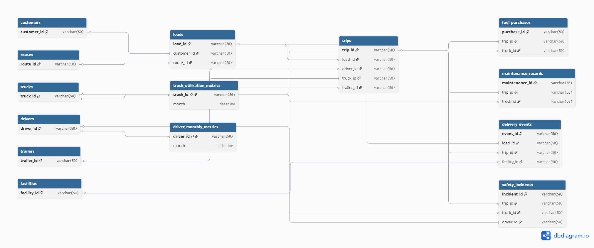

# Logistics SQL Analytics

## Project Overview
This project presents an end-to-end logistics analytics case study using SQL to evaluate **operational efficiency**, **asset utilization**, and **cost & profitability** across a transportation network.  
The analysis focuses on transforming relational transactional data into actionable business insights using structured SQL and data modeling best practices.

---

## Problem Statement
Logistics operations generate large volumes of data across shipments, trips, fleet assets, and operating costs.  
This project aims to answer key operational and financial questions such as:
- Which routes and facilities create execution bottlenecks?
- How effectively are fleet assets being utilized?
- What factors drive profitability and financial risk across routes, customers, and assets?

The objective is to support **data-informed operational and strategic decision-making**.

---

## Dataset Source
This project uses the **Synthetic Logistics Operations Database (2022–2024)** available on Kaggle.

**Citation:**  
Yogape Rodriguez (2025). 
*Synthetic Logistics Operations Database (2022–2024).
Kaggle Dataset. https://www.kaggle.com/datasets/yogape/logistics-operations-database

**Dataset Description:**  
A synthetic, relational logistics dataset containing 85,000+ records, designed to simulate real-world transportation operations, including shipments, fleet assets, fuel usage, maintenance activity, and safety incidents.

---

## Dataset Tables Overview

### Dimension Tables
These tables provide master data and descriptive attributes:
- **customers** – customer profile, contract type, and annual revenue potential  
- **routes** – origin, destination, distance, and pricing attributes  
- **trucks** – truck specifications, model year, status, and acquisition details  
- **trailers** – trailer type, capacity, and status  
- **drivers** – driver profiles, hire and termination dates  
- **facilities** – pickup and delivery facility information  

---

### Fact Tables
These tables capture transactional and operational activity:
- **loads** – shipment-level data including revenue and customer linkage  
- **trips** – physical execution of loads using assigned assets  
- **delivery_events** – pickup and delivery timestamps, detention, and event details  
- **fuel_purchases** – fuel transactions linked to trips and assets  
- **maintenance_records** – maintenance activity with labor and parts costs  
- **safety_incidents** – safety events including vehicle damage, cargo damage, and claim amounts  

---

### Metrics Tables
Pre-aggregated performance metrics used for reference:
- **driver_monthly_metrics** – monthly driver performance indicators  
- **truck_utilization_metrics** – monthly truck utilization and efficiency metrics  

---

## Data Model Overview
The following entity-relationship diagram illustrates the core operational, cost, and performance tables used in the analysis, along with their relationships across execution, assets, and financial tracking.



The diagram highlights the execution flow from customers and routes through loads and trips, with downstream cost and performance tracking.


---

## Project Structure

```text
Logistic_analysis_SQL/
├── README.md
│
├── data_model/
│   └── er_diagram.png
│
├── sql/
│   ├── data_cleaning.sql
│   ├── operations_and_efficiency.sql
│   ├── asset_utilization.sql
│   └── cost_and_profitability.sql
│
├── insights/
│   ├── operations_efficiency.md
│   ├── asset_utilization.md
│   └── cost_profitability.md
│
└── sample_outputs/
    ├── operations/
    ├── asset_utilization/
    └── cost_profitability/

```

---

## Analysis Sections

### 1. Operations & Efficiency
Analyzes route-level and facility-level execution performance, including revenue productivity, transit delays, detention contributors, idle time, downtime, and delivery cycle times.

- SQL file: `sql/operations_and_efficiency.sql`  
- Insights: `insights/operations_efficiency.md`

---

### 2. Asset Utilization
Evaluates how effectively trucks and trailers are utilized using trip-level time decomposition.  
The analysis highlights utilization balance, revenue productivity, downtime patterns, and the impact of asset age.

- SQL file: `sql/asset_utilization.sql`  
- Insights: `insights/asset_utilization.md`

---

### 3. Cost & Profitability
Examines profitability drivers by linking executed revenue with actual fuel, maintenance, and safety-related costs across loads, routes, customers, and assets.

- SQL file: `sql/cost_and_profitability.sql`  
- Insights: `insights/cost_profitability.md`

---

## Key Findings
- Route-level profitability varies significantly, with some high-revenue routes generating weak or negative margins due to high fuel intensity.
- Customer profitability remains consistently positive, and high revenue potential does not necessarily translate into higher margins.
- Maintenance cost per mile shows limited variation across trucks and does not materially impact overall profitability.
- Safety-related financial losses are highly concentrated, with a small subset of assets accounting for most claim costs.
- Load-level profitability exhibits extreme variance driven by fuel purchase timing, making higher-level aggregation more reliable for decision-making.

---

## Assumptions & Limitations
- Fuel cost is derived from **actual fuel purchase transactions** and aggregated at the trip level.
- Fuel surcharge and accessorial charges are treated as **revenue components**, not costs.
- Profit calculations focus on **fuel as the primary variable operating cost**; indirect and fixed costs are excluded.
- Load-level profitability reflects **fuel cost exposure**, not precise accounting margins, due to fuel purchase timing.
- Route, customer, and asset-level analyses are considered more reliable due to aggregation effects.

---

## Tools & Skills Used
- SQL (MySQL)
- Relational data modeling and schema design
- Advanced joins across fact and dimension tables
- Common Table Expressions (CTEs) for stepwise analysis
- Window functions for ranking and time-based calculations
- Views for reusable cost and utilization logic
- Aggregation and normalization for multi-level analysis
