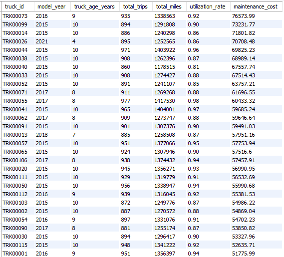
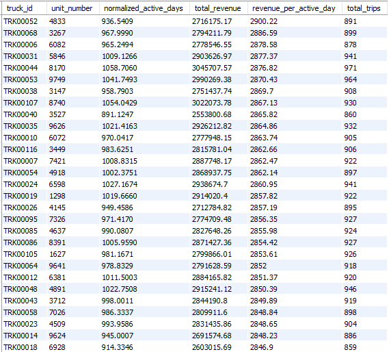
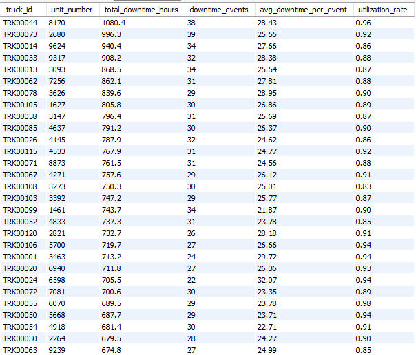
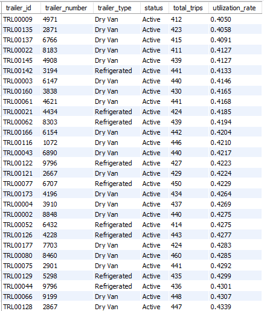

# Asset Utilization Insights

## What Was Analyzed
This section evaluates how effectively **fleet assets (trucks and trailers)** are utilized across the logistics network.  
The analysis is based on **trip-level time decomposition**, focusing on operating time, revenue productivity, downtime, and utilization balance across assets.

Key questions addressed include:
- How evenly fleet capacity is utilized
- The impact of asset age on utilization and maintenance
- Revenue productivity per operating day
- Downtime concentration across assets
- Trailer utilization efficiency

---

## Key Findings

### 1. Fleet Utilization Is Generally Balanced Across Active Trucks
Most active trucks exhibit similar utilization rates, indicating that capacity is **evenly distributed** rather than concentrated on a small subset of assets.

This suggests that underutilization is not driven by asset availability alone, but by broader operational constraints.

---

### 2. Truck Age Has Limited Impact on Utilization but Influences Maintenance Costs
Older trucks remain comparably utilized relative to newer assets, indicating effective fleet deployment.  
However, maintenance costs increase with asset age, introducing **cost efficiency considerations** rather than utilization limitations.

---

### 3. Revenue Productivity Varies Across Trucks Despite Similar Utilization
Even with comparable utilization rates, trucks generate different levels of revenue per operating day.

This highlights the influence of **route assignment and load mix** on asset productivity.

---

### 4. Downtime Is Concentrated Among a Subset of Assets
A small number of trucks account for a disproportionate share of total maintenance downtime.

Downtime is driven more by **frequency of maintenance events** than by exceptionally long individual repairs.

---

### 5. Trailer Utilization Is Lower and More Variable Than Truck Utilization
Trailers exhibit lower utilization rates compared to trucks, reflecting their role as **flexible buffer assets** rather than capacity bottlenecks.

---

## Analytical Interpretation

- Balanced utilization suggests that fleet size is not the primary constraint on execution capacity.
- Asset age impacts **cost efficiency** more than operational availability.
- Revenue productivity differences are driven by deployment decisions rather than asset usage levels.
- Downtime concentration presents opportunities for **targeted maintenance interventions**.
- Trailer slack provides operational flexibility but may mask inefficiencies if over-provisioned.

---

## Decision Implications

- Focus optimization efforts on **route and load assignment**, not fleet expansion.
- Incorporate maintenance cost trends into asset replacement and lifecycle planning.
- Prioritize reliability improvements for **high-downtime trucks** to improve overall fleet availability.
- Monitor trailer utilization to balance flexibility with capital efficiency.

---

## Supporting Outputs
Additional query outputs and supporting tables are available in:
`sample_outputs/asset_utilization/`
