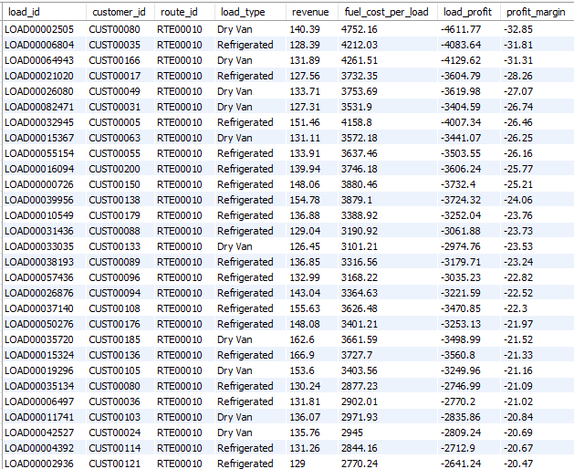
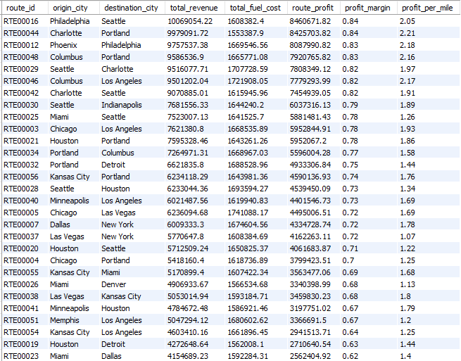
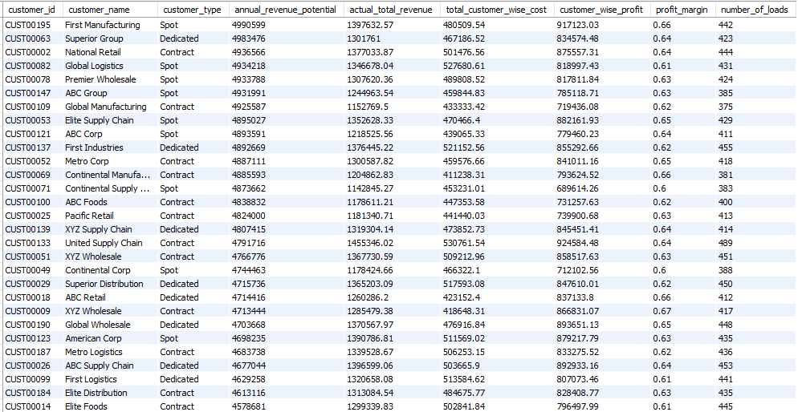
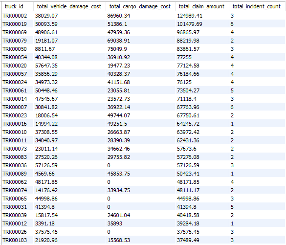

# Cost & Profitability Insights

## What Was Analyzed
This section evaluates **cost drivers and profitability patterns** across loads, routes, customers, and fleet assets.  
The analysis links executed revenue with **actual fuel costs**, **maintenance expenses**, and **safety-related losses** to understand margin variability and financial risk.

Key questions addressed include:
- Load-level exposure to fuel cost volatility
- Route-level margin strength versus revenue scale
- Customer profitability relative to revenue potential
- Impact of maintenance costs on truck profitability
- Concentration of safety-related financial losses

---

## Key Findings

### 1. Load-Level Profitability Shows High Variability Due to Fuel Cost Timing
Profitability at the individual load level varies widely, with some loads appearing strongly loss-making.

This variance is driven primarily by **fuel purchase timing**, where fuel costs are incurred at the trip level rather than isolated to individual loads.

---

### 2. High-Revenue Routes Do Not Always Deliver Strong Margins
Several routes generate substantial total revenue but exhibit weak or negative profit margins once fuel costs are accounted for.

This highlights the importance of evaluating **profit per mile and margin**, not revenue alone.

---

### 3. High Revenue Potential Customers Are Not Necessarily More Profitable
Customers with high annual revenue potential generally contribute higher total revenue, but profit margins remain relatively consistent across customer segments.

This suggests standardized pricing structures rather than differentiated margin strategies.

---

### 4. Maintenance Costs Have Limited Impact on Overall Truck Profitability
Maintenance cost per mile varies across trucks but does not materially erode profitability for most assets.

Fuel cost remains the dominant variable cost driver at the asset level.

---

### 5. Safety-Related Financial Losses Are Highly Concentrated
A small subset of trucks accounts for the majority of safety-related claim costs, including vehicle and cargo damage.

This concentration indicates that safety risk is **asset-specific rather than systemic**.

---

## Analytical Interpretation

- Load-level profitability is best interpreted as **fuel cost exposure**, not realized margin.
- Route-level aggregation smooths timing distortions and provides a more reliable profitability signal.
- Customer profitability stability reflects contract-driven pricing rather than operational differentiation.
- Maintenance costs affect cost efficiency but rarely dominate profitability outcomes.
- Safety incidents represent **episodic but high-impact financial risk**.

---

## Decision Implications

- Avoid pricing or performance decisions based solely on load-level margins.
- Use route-level profitability to identify **fuel-intensive or structurally weak routes**.
- Monitor customer profitability in conjunction with service complexity rather than revenue size alone.
- Target preventive maintenance and safety interventions toward **high-cost assets** to reduce financial exposure.

---

## Supporting Outputs
Additional query outputs and supporting tables are available in:
`sample_outputs/cost_profitability/`
