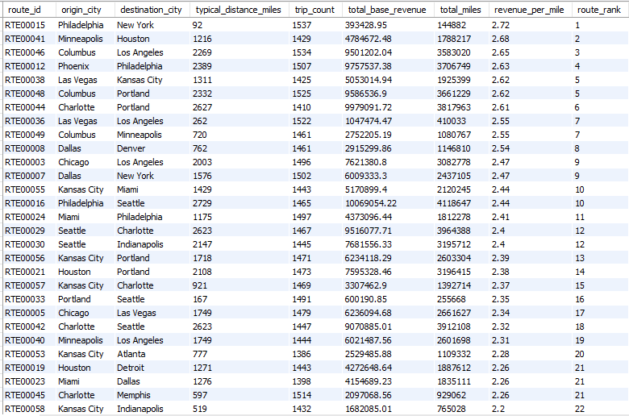
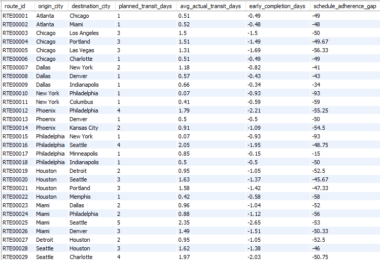
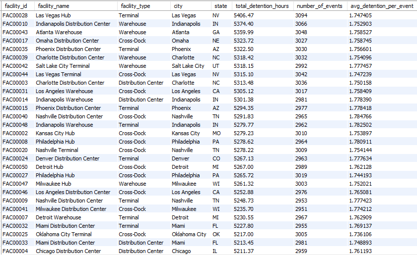
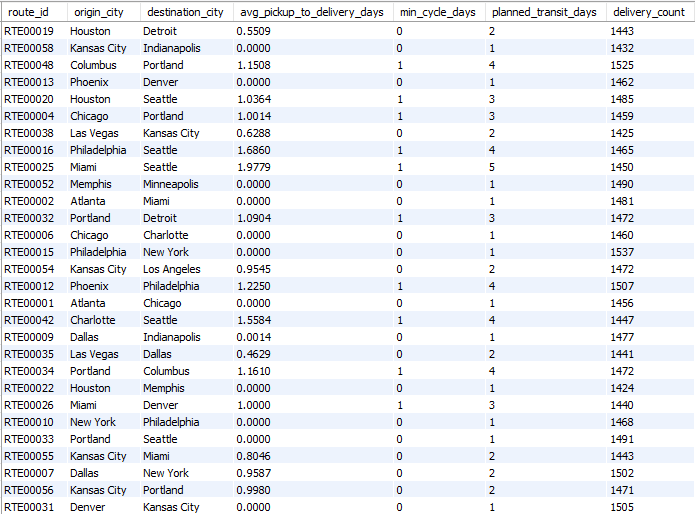

# Operations & Efficiency Insights

## What Was Analyzed
This section evaluates **route-level and facility-level execution performance** across the logistics network.  
The analysis focuses on how efficiently shipments are executed by examining revenue productivity, transit adherence, detention exposure, idle time, downtime, and delivery cycle times.

Key operational questions addressed include:
- Revenue productivity across routes
- Planned vs actual transit performance
- Facility-driven detention impact
- Idle time and downtime patterns
- End-to-end delivery cycle efficiency

---

## Key Findings

### 1. Revenue Productivity Varies Widely Across Routes
Revenue generated per mile differs significantly by route, indicating uneven pricing efficiency relative to distance traveled.

Routes with similar distances can exhibit materially different revenue productivity, highlighting the importance of efficiency-normalized metrics over absolute revenue.

---

### 2. Planned Transit Times Are Generally Conservative
Most routes complete deliveries faster than their planned transit days, resulting in negative transit gaps (early completion).

This suggests route planning assumptions include buffers rather than reflecting persistent execution delays.

---

### 3. Detention Time Is Concentrated at Specific Facilities
Detention hours are not evenly distributed across the network. A small subset of facilities accounts for a disproportionate share of total detention time.

This points to localized operational bottlenecks rather than systemic execution issues.

---

### 4. Delivery Cycle Times Differ Meaningfully by Route
Average pickup-to-delivery cycle time varies across routes, with longer-haul routes exhibiting higher variability.

Zero-day cycles indicate same-day pickup and delivery, while multi-day cycles reflect distance and routing complexity.

---

## Analytical Interpretation

- Revenue efficiency is better assessed using **per-mile metrics** rather than total revenue.
- Early completions imply opportunities to tighten planned transit standards and improve asset turnover.
- Detention is driven more by **facility-level processes** than by route design.
- Cycle time variability reflects structural differences in distance and execution complexity rather than random delays.
- Idle and downtime appear structurally embedded and are best interpreted at aggregate levels.

---

## Decision Implications

- Review pricing and route design for **low revenue-per-mile routes**.
- Recalibrate planned transit benchmarks to better reflect actual execution.
- Prioritize operational improvements at **high-detention facilities** to unlock network-wide gains.
- Use route-level cycle time benchmarks to identify scheduling and execution optimization opportunities.

---

## Supporting Outputs
Additional query outputs are available in:
`sample_outputs/operations/`
